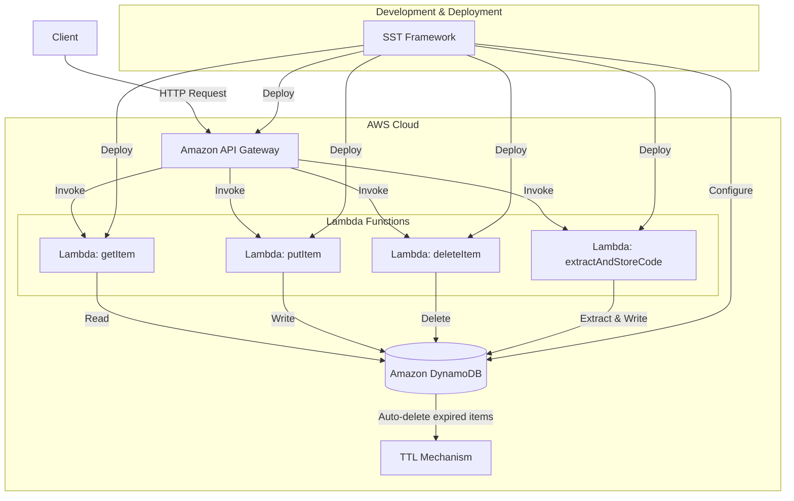

# Contributing to Key-Value Store API

This document explains the local development environment setup and development workflow for the Key-Value Store API project.

## AWS Architecture

This project implements a serverless architecture using multiple AWS services. The architecture diagram below illustrates how these services interact with ## Deployment

After testing your changes locally, to deploy to AWS:

```bash
# Standard deployment
npm run deploy

# Deploy to specific stage
npm run deploy -- --stage staging

# Deploy with additional tags to specific stage
PROJECT_NAME=my-project OWNER=team-name npm run deploy -- --stage prod
```

The unified deployment script provides flexible deployment options. You can also use it directly:

```bash
# View all available options
./scripts/deploy.sh --help

# Examples of direct script usage
./scripts/deploy.sh --with-tags --stage prod
./scripts/deploy.sh --stage dev
```

This command uses SST to deploy your application. Make sure your AWS credentials are correctly configured before deploying.

### Architecture Diagram



### Architecture Components

- **API Gateway**: Provides a RESTful API interface for clients to interact with the service.
- **AWS Lambda**: Contains serverless functions that handle the business logic:
  - `getItem`: Retrieves values from DynamoDB using a key
  - `putItem`: Stores key-value pairs in DynamoDB
  - `deleteItem`: Removes items from DynamoDB based on a key
  - `extractAndStoreCode`: Extracts numeric codes from text and stores them
- **DynamoDB**: NoSQL database that stores the key-value pairs with automatic TTL capabilities
- **SST (Serverless Stack Toolkit)**: Used for infrastructure as code, simplifying the deployment process

This architecture provides a highly scalable, cost-effective solution with minimal operational overhead as it leverages AWS's managed services and the serverless computing model.

## Project Structure

```
key-value-store-api/
├── CONTRIBUTING.md         # Contribution guidelines
├── LICENSE                 # MIT license
├── README.md               # Project documentation
├── eslint.config.js        # ESLint configuration
├── openapi.yaml            # OpenAPI specification
├── package.json            # Project dependencies and scripts
├── prettier.config.js      # Prettier configuration
├── sst.config.ts           # SST configuration
├── stacks/
│   └── ApiStack.ts        # SST API stack definition
├── tsconfig.json           # TypeScript configuration
├── vitest.config.ts        # Vitest configuration
├── vitest.setup.ts         # Vitest setup file
├── scripts/
│   ├── create-local-table.sh  # Script to create local DynamoDB table
│   ├── deploy-with-tags.sh    # Script for deployment with cost tracking tags
│   ├── seed-data.json         # Sample data for development
│   └── setup.sh               # Environment setup script
├── src/
│   ├── handlers/
│   │   ├── deleteItem.ts         # Handler for deleting an item
│   │   ├── extractAndStoreCode.ts # Handler for extracting and storing codes
│   │   ├── getItem.ts            # Handler for retrieving an item
│   │   ├── index.ts              # Index exports for handlers
│   │   └── putItem.ts            # Handler for adding a new item
│   ├── types/
│   │   └── index.ts            # Type definitions and interfaces
│   └── utils/
│       ├── dynamoDBClient.ts   # DynamoDB client configuration
│       ├── repositoryFactory.ts # Repository factory for DynamoDB operations
│       └── ttlHelper.ts        # TTL functionality helper
└── tests/
    ├── integration/
    │   ├── api.test.ts          # Integration tests for the API
    │   ├── apiClient.ts         # API client for integration tests
    │   └── setup.ts             # Setup for integration tests
    └── unit/
        ├── deleteItem.test.ts         # Unit tests for delete handler
        ├── extractAndStoreCode.test.ts # Unit tests for extract and store handler
        ├── getItem.test.ts            # Unit tests for get handler
        ├── putItem.test.ts            # Unit tests for put handler
        └── ttlHelper.test.ts          # Unit tests for TTL helper
```

## Development Environment Setup

There are two ways to set up the development environment:

1. **DevContainer (Recommended)**: Development environment using VS Code
2. **Traditional Method**: Direct setup on your local machine

### Development with DevContainer (Recommended)

Using DevContainer provides a consistent development environment with all the tools and dependencies pre-configured for the project.

#### Prerequisites

- [VS Code](https://code.visualstudio.com/)
- [Dev Containers extension](https://marketplace.visualstudio.com/items?itemName=ms-vscode-remote.remote-containers) for VS Code
- [Docker Desktop](https://www.docker.com/products/docker-desktop/) or other Docker-compatible environment

#### Setup Steps

1. Clone the repository:

   ```bash
   git clone https://github.com/kunikada/key-value-store-api.git
   cd key-value-store-api
   ```

2. Open the project folder in VS Code:

   ```bash
   code .
   ```

3. VS Code will detect the `.devcontainer` folder and prompt you to "Reopen in Container".
   Alternatively, open the command palette (`F1` key) and select "Remote-Containers: Reopen in Container".

4. The DevContainer will build, and VS Code will automatically restart inside the container.
   This process may take a few minutes on first run.

5. Once the container starts, all dependencies will be automatically installed and the development environment will be configured.

### Traditional Method (Direct Setup)

#### Prerequisites

Before starting development, you need to have the following tools installed:

- Node.js 22.x or higher
- npm 10.x or higher
- AWS CLI
- Java Runtime Environment (JRE) 11 or higher (for DynamoDB local)

#### Environment Setup Steps

1. Clone the repository:

   ```bash
   git clone https://github.com/kunikada/key-value-store-api.git
   cd key-value-store-api
   ```

2. Install dependencies:

   ```bash
   npm install
   ```

3. Configure environment variables:

   ```bash
   cp .env.example .env
   ```

   Open the `.env` file and edit the values as needed.

4. Run the setup script:
   ```bash
   bash ./scripts/setup.sh
   ```

## Local Development

### Starting the Local Development Environment

The simplest way is to use the SST development environment:

```bash
npm run dev
```

This command:

1. Starts the SST development environment
2. Sets up a Live Lambda development environment to test your functions

For local development with local DynamoDB:

```bash
npm run dev:local
```

This command:

1. Sets up a local DynamoDB table
2. Starts the SST development environment

### Setting Up Individual Services

You can also set up services individually:

#### Running Local DynamoDB

If you need to create or configure DynamoDB tables locally:

```bash
bash ./scripts/create-local-table.sh
```

This command creates a local DynamoDB table named `KeyValueStore` (or the name specified in your environment variables).

### Debugging

If you're using VS Code, you can use the pre-configured debug configurations in `.vscode/launch.json`:

1. Debugging tests:

   - Open a test file and select "Debug Tests" from the VS Code debug panel

2. Debugging SST:
   - First, start the SST development environment:
     ```bash
     npm run dev
     ```
   - Use the SST Console and Live Lambda Development to debug your functions

## Testing

### Running Unit Tests

```bash
npm test
```

### Running Tests in Watch Mode

```bash
npm run test:watch
```

### Checking Test Coverage

```bash
npm run test:coverage
```

## Code Style and Linting

This project uses ESLint and Prettier to maintain code quality and style.

### Running Linting

```bash
npm run lint
```

### Auto-fixing Issues

```bash
npm run lint:fix
```

### Code Formatting

```bash
npm run format
```

## 認証・API Keyの利用

このAPIはAPI Key認証が有効です。API KeyはSST Secretとして管理され、Lambdaオーソライザーで検証されます。

### API Keyのセット・取得

1. Secretの登録（初回のみ）

```bash
sst secret set ApiKey <your-api-key>
```

2. デプロイ

```bash
npm run deploy
```

3. API Keyを使ったリクエスト例

```bash
curl -H "x-api-key: <your-api-key>" https://<api-url>/item/testKey
```

### よく使うnpmコマンド

- 開発サーバー起動: `npm start`
- テスト実行: `npm test`
- デプロイ: `npm run deploy`
- Secret登録: `sst secret set ApiKey <your-api-key>`

## Testing the API

To test the API in the local environment, you can use curl commands as follows:

### Authentication

When testing with SST, API key authentication is enabled. You need to pass an API key with each request:

```bash
# For local development, you can use any string as the API key
API_KEY="dev-api-key-for-testing"
```

For deployed environments, you need to retrieve the actual API key:

```bash
# Get information about your deployment
npm run console

# Or directly get the API key using AWS CLI
API_KEY=$(aws apigateway get-api-keys --name-query "KeyValueStoreApiKey" --include-values --query "items[0].value" --output text)
```

### Getting an Item

```bash
curl -H "x-api-key: $API_KEY" http://localhost:3000/item/testKey
```

### Saving an Item

```bash
curl -X PUT \
  -H "Content-Type: text/plain" \
  -H "X-TTL-Seconds: 3600" \
  -H "x-api-key: $API_KEY" \
  -d "Test data" \
  http://localhost:3000/item/testKey
```

### Extracting and Storing a Code

```bash
curl -X POST \
  -H "Content-Type: text/plain" \
  -H "X-TTL-Seconds: 3600" \
  -H "x-api-key: $API_KEY" \
  -d "Your verification code is 123456" \
  http://localhost:3000/extractCode/testKey
```

### Deleting an Item

```bash
curl -X DELETE -H "x-api-key: $API_KEY" http://localhost:3000/item/testKey
```

## Deployment

After testing your changes locally, to deploy to AWS:

```bash
npm run deploy
```

This command uses SST to deploy your application. Make sure your AWS credentials are correctly configured before deploying.

### Deployment with Additional Tags

In SST v3, tags are configured in `sst.config.ts`. You can add additional tags via environment variables:

```bash
# Deploy with additional project and owner tags
PROJECT_NAME=my-custom-project OWNER=team-name npm run deploy

# Deploy to specific stage with tags
PROJECT_NAME=my-project ./scripts/deploy.sh --with-tags --stage dev
```

The following tags are always applied automatically:
- `Environment`: Matches the deployment stage (dev, staging, prod)
- `ManagedBy`: Always set to "SST"

Additional tags can be set via environment variables:
- `PROJECT_NAME`: Adds a "Project" tag
- `OWNER`: Adds an "Owner" tag

You can also specify a stage for deployment:

```bash
npm run deploy -- --stage dev
```

To remove a deployment:

```bash
npm run remove
```

## Recommended Development Tools

We recommend using the following VS Code extensions for this project:

- ESLint
- Prettier
- TypeScript Next
- AWS Toolkit
- YAML
- Docker
- DotENV
- Path Intellisense
- Vitest

## CI/CD

A CI pipeline using GitHub Actions is set up. Pushes to the master or main branch will automatically run tests to ensure code quality. Deployment is performed manually after tests have passed successfully.
